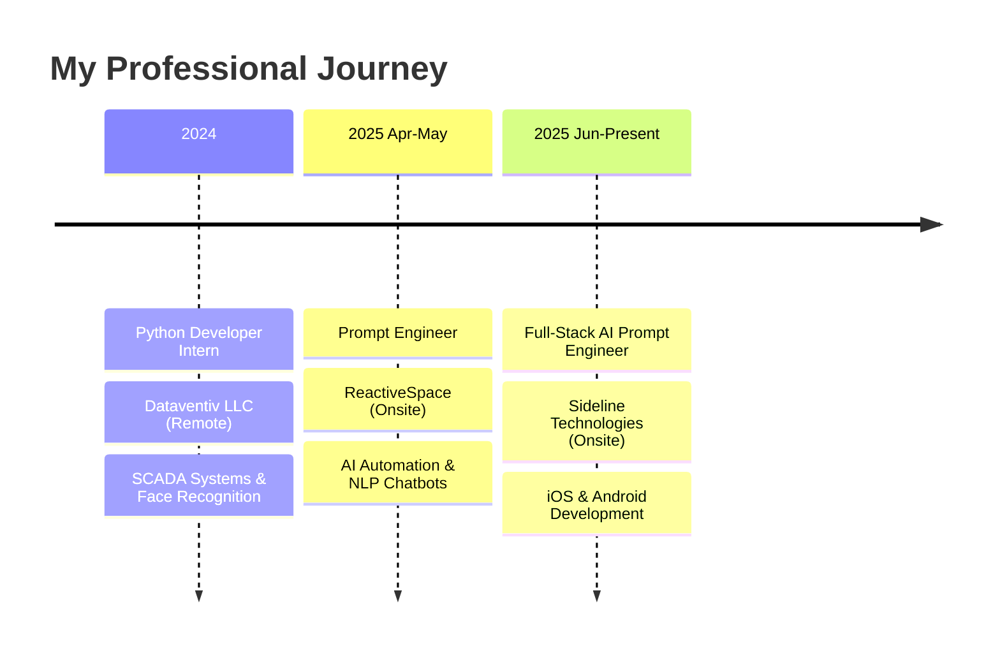

<div align="center">

<!-- Animated Header -->


<!-- Typing Animation -->
<a href="https://git.io/typing-svg"></a>

<br>

<!-- Social Badges -->
[](https://www.linkedin.com/in/msharjeelsaleem/)
[](https://sharjeel-portfolio.netlify.app)
[](mailto:sharry00010@gmail.com)


</div>

---


## 🧑‍💻 About Me

```typescript
const sharjeel = {
    role: "Full-Stack AI Prompt Engineer",
    company: "Sideline Technologies",
    location: "Pakistan 🇵🇰",
    
    currentFocus: [
        "Building AI-Powered Mobile Apps",
        "Cross-Platform Development",
        "LLM Token Optimization"
    ],
    
    expertise: {
        aiTools: ["Cursor AI", "Claude", "Windsurf", "Trae AI"],
        mobile: ["iOS (Swift)", "Android (Kotlin)", "React Native"],
        web: ["Next.js", "React", "TypeScript", "FastAPI"],
        ml: ["YOLOv8", "OpenCV", "LangChain", "LangGraph"]
    },
    
    funFact: "I build production apps using vibe coding! 🚀"
};
```

<br clear="both"/>

---

## 🛠️ Tech Arsenal

<div align="center">

### 🤖 AI & Prompt Engineering
<p>


</p>

### 💻 Languages
<p>


</p>

### 🌐 Frameworks & Libraries
<p>


</p>

### 🧠 AI/ML & Computer Vision
<p>


</p>

### 🗄️ Databases & Cloud
<p>


</p>

</div>

---

## 🚀 Featured Projects

<div align="center">
<table>
<tr>
<td width="50%">

### 🎯 Kani LLM Token Optimizer
<a href="https://kani-llm-token-optimizer.netlify.app/">

</a>
<a href="https://github.com/Sharjeel-Saleem-06/Kani-LLM-Token-Optimizer">

</a>

**AI-powered token optimization framework**

`Next.js` `TypeScript` `AI` `TailwindCSS`

</td>
<td width="50%">

### 🚗 Autopilot Pro
<a href="https://autopilot-pro.netlify.app/">

</a>
<a href="https://github.com/Sharjeel-Saleem-06/Autopilot-pro">

</a>

**YOLOv8-powered driving assistant**

`Python` `YOLOv8` `OpenCV` `Deep Learning`

</td>
</tr>
<tr>
<td width="50%">

### 🖼️ ImagePro Advanced
<a href="https://imagepro-advanced.netlify.app/">

</a>
<a href="https://github.com/Sharjeel-Saleem-06/Image-pro">

</a>

**Advanced image processing platform**

`Next.js` `TypeScript` `AI` `Image Processing`

</td>
<td width="50%">

### 📄 DocConverter Pro
<a href="https://docconverter-pro.netlify.app/">

</a>
<a href="https://github.com/Sharjeel-Saleem-06/Doc-Converter-pro">

</a>

**Multi-format document converter**

`React` `Node.js` `PDF APIs` `15+ Formats`

</td>
</tr>
<tr>
<td width="50%">

### 🎓 StudyFlow Quiz App
<a href="https://studyflow-quizapp.netlify.app/">

</a>

**AI-powered learning platform with gamification**

`Next.js` `AI` `Gamification` `50K+ Users`

</td>
<td width="50%">

### 📊 Student Performance Predictor
<a href="https://student-performance-monitoring.netlify.app/">

</a>
<a href="https://github.com/Sharjeel-Saleem-06/student-performance-predictor">

</a>

**ML-powered score prediction (88% accuracy)**

`Python` `Flask` `Scikit-Learn` `XGBoost`

</td>
</tr>
<tr>
<td width="50%">

### 🤖 AI ChatBot
<a href="https://github.com/Sharjeel-Saleem-06/Langgraph-ChatBot">

</a>

**LangGraph + LangChain intelligent chatbot**

`Python` `LangGraph` `LangChain` `Groq API`

</td>
<td width="50%">

### 👤 Face Recognition Attendance
<a href="https://github.com/Sharjeel-Saleem-06/Face-Reconition-Attendence-Sytem-">

</a>

**Real-time face detection attendance system**

`Python` `OpenCV` `MySQL` `Tkinter`

</td>
</tr>
</table>
</div>

---

## 📈 GitHub Stats

<div align="center">


</div>

<div align="center">

</div>

---

## 🏆 Achievements

<div align="center">


</div>

---

## 💼 Career Journey

<div align="center">



</div>

---

## 📊 Weekly Development Breakdown

<!--START_SECTION:waka-->
```text
TypeScript   12 hrs 30 mins  ████████████░░░░░░░░░  45.2%
Python       8 hrs 15 mins   ███████░░░░░░░░░░░░░░  29.8%
Swift        3 hrs 45 mins   ███░░░░░░░░░░░░░░░░░░  13.5%
Kotlin       2 hrs 10 mins   ██░░░░░░░░░░░░░░░░░░░   7.8%
Other        1 hr 00 mins    █░░░░░░░░░░░░░░░░░░░░   3.7%
```
<!--END_SECTION:waka-->

---

## 🤝 Let's Build Something Amazing

<div align="center">

<a href="https://www.linkedin.com/in/msharjeelsaleem/">

</a>
<a href="https://sharjeel-portfolio.netlify.app">

</a>
<a href="mailto:sharry00010@gmail.com">

</a>

<br><br>

### 💡 *"I don't just write code, I engineer intelligent solutions with AI"*

<br>

**🔥 Open to collaborating on AI-powered projects!**

</div>

---

<div align="center">

### 🐍 Contribution Snake

<picture>
  <source media="(prefers-color-scheme: dark)" srcset="https://raw.githubusercontent.com/platane/platane/output/github-contribution-grid-snake-dark.svg">
  <source media="(prefers-color-scheme: light)" srcset="https://raw.githubusercontent.com/platane/platane/output/github-contribution-grid-snake.svg">
  
</picture>

</div>

<!-- Footer -->

